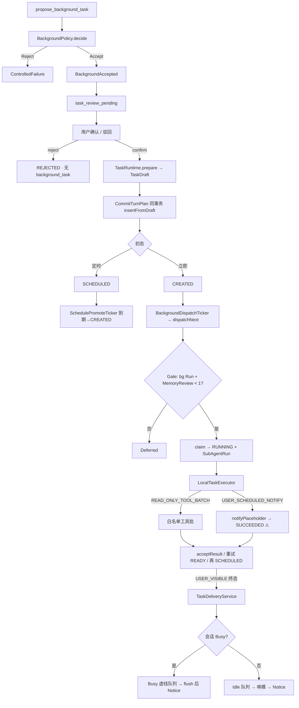

# 2.5 · Task 系统整体逻辑审阅 + 同业对照（2026-09-28）

`status`: **审阅账本 · 已关闭** — 发现日 2026-09-28；随 **2.5 周期完成**（2026-09-29）  
`scope`: 生产 `wn-server/` 端到端 Task 逻辑；对照 OpenClaw / Claude Code / Cursor / Codex·DSH  
`not`: 本文件**不**授权写生产码；历史发现正文不改写  
`upstream`: [k05-task-background.md](../k05-task-background.md)  
`peers_base`: [background-task-peers-2.5.md](../../../../research/history/background-task-peers-2.5.md) · [task-schedule-rules-2.5.md](../../../../research/history/task-schedule-rules-2.5.md)  
`current_minor`: **2.5.13 收口完成 · 周期关闭**

> **一句话结论（2026-09-28）：** 生产全链路已通；NOTIFY 已改为 `fired`+先中心后唤模（2.5.12）。残余 P1 已由 **2.5.13** 关闭或书面降级。  
> **关闭（2026-09-29）：** 用户确认「2.5 周期完成」。归档 [archive/2.5](../README.md)。

---

## 0. 审阅范围与证据等级

| 等级 | 含义 |
|------|------|
| **V** | 已读生产源码 / 官方文档正文 |
| **S** | 对照既有 research 与 P2 规格的静态推断 |
| **T** | 待 2.5.13 窄测/真人验证 |

本轮以 **V** 为主；同业页为 2026-09-28 再拉取。

---

## 1. 端到端逻辑图（生产实际）



**状态机要点（实际，非理想叙事）：**

```text
SCHEDULED ──promote──► CREATED ──claim──► RUNNING ──成功──► SUCCEEDED
                              ▲              │                 │
                              │              │ 可重试失败        │ 多次日程
                              │              ▼                 ▼
                              └──────────── READY ◄────── SCHEDULED(next_fire)
                                               ▲
                                    LOST orphan 无条件拉回 READY（见 §4 P1）
```

- 首次派发常 **跳过 READY**：`CREATED → RUNNING`。  
- `LEASED` / `CANCEL_REQUESTED` / `WAITING` 枚举存在，生产路径几乎不产。

---

## 2. 组件职责（生产）

| 层 | 组件 | 职责 |
|----|------|------|
| 提案 | `propose_background_task` + Loop | 模型起草 → `TaskProposal` |
| 裁决 | `DefaultBackgroundPolicy` | 类型/日程/空输入；**ACTIVE 会话检查当前无效**（§4） |
| 审核门 | `task_review_pending` + `TaskReviewService` | 确认后才 `prepare`+Commit；驳回不落库 |
| 草稿 | `TaskRuntime.prepare` + `ScheduleResolver` | 校验 → `TaskDraft`（不写库） |
| 落库 | `SqliteTurnCommitter` | 与确认回复同事务 `insertFromDraft` |
| 定时 | `SchedulePromoteTicker` | **只** `SCHEDULED→CREATED` |
| 派发 | `BackgroundDispatchTicker` + Gate | 只扫可执行行；槽 ≤1（与 Review 合计） |
| 执行 | `LocalTaskExecutor` | 工具批 **或** NOTIFY **placeholder** |
| 交付 | `TaskDeliveryService` / Idle worker | Busy 虚线 / Idle 唤模 |
| 打断 | `NoticeCenter` | 现：交付可见**之后**；2.5.12 目标：NOTIFY **先**中心 |
| 读面 | Query + 侧栏 / 任务中心 / 审核 UI | UI 人话预览已部分先行入仓 |

**双系统：** Memory Review（`memory_review_job`）≠ TaskRuntime；仅共享并发门闩，且门闩**单向**（Task 等 Review，Review 不查 SubAgentRun）。

---

## 3. 不变量符合度

| 不变量（k05 §3 / 2.5.12） | 生产 | 证据 |
|---------------------------|------|------|
| 审核通过后 Draft 同事务落库 | **OK** | Review → CommitTurnPlan → insertFromDraft |
| 未确认无 Task 行 | **OK** | 仅 review pending |
| 未到期 SCHEDULED 不被执行号扫 | **OK** | claim 仅 CREATED/READY；晋升独立 |
| 重试 = 新 Run；Run LOST 不复活 | **部分** | Run 保持 LOST；**Task** 可被 orphan 逻辑无限拉 READY |
| Busy/Idle 只约束交付不禁执行 | **OK** | 交付在 accept 后 |
| 1+1 执行槽 + 模型多窗 | **部分** | Task 侧守门；Memory Review 可绕过合计≤1 |
| 禁止 placeholder 成功 / 先中心后唤模 | **FAIL** | `LocalTaskExecutor.notifyPlaceholder` 仍活；Notice 在交付后 |
| SubAgent 不写 Memory/冒充终答 | **OK** | 本地白名单工具；终答走 Kernel 交付 |

---

## 4. 缺陷与优化（按优先级）

### P0 · 阻塞「看微信」产品主路径（= 2.5.12 范围）

| ID | 问题 | 建议 |
|----|------|------|
| **O1** | NOTIFY 成功仍是 `status:placeholder`，无 `message` | 按已放行 P2：合入 draft 的 `NotifyInput` + `notifyFired`；无正文 Reject |
| **O2** | Notice 在 Busy flush / Idle 落字**之后**才发；中心无提醒句 | `onTaskTerminal(NOTIFY·SUCCEEDED)`：**先**提醒专用 publish，**再**入 Busy/Idle；payload 带 `message` + `noticeAlreadySent` |
| **O3** | Idle 报告块无强制正文 → 模型易说「没有提醒内容」 | 系统块钉死「中心已提醒 + 正文」文案（P2 §5.3） |

> UI 子集（去 more、人话 preview、气泡时间）已先行；**不要**再扩 UI，优先合 Executor/Delivery。

### P1 · 正确性 / 竞态（建议 2.5.12 旁记或 2.5.13）

| ID | 问题 | 建议 |
|----|------|------|
| **O4** | `BackgroundPolicyContext.empty()` → ACTIVE 守卫永不触发 | Loop 传入真实会话状态，或删死代码并文档声明「提案阶段不查 ACTIVE」 |
| **O5** | LOST reclaim：`RUNNING`+无活 Run → 无条件 `READY`，无视 `maxAttempts` | reclaim 时读 attempt/max；超限 → `FAILED` |
| **O6** | 非 SCHEDULED 取消路径缺少 expected-status CAS | 与 claim/accept 统一 CAS；或启用 `CANCEL_REQUESTED` |
| **O7** | Memory Review 不查 Gate → 可与 bg Run 双跑 | Review worker 启动前同一 `BackgroundConcurrencyGate`；或文档降级「门闩仅约束 Task 侧」并改 Q7 表述 |
| **O8** | `acceptResult` 重试 `casStatus(RUNNING→READY)` 返回值未检查 | 失败打日志并勿静默丢更新 |
| **O9** | 交付 hook best-effort：终态 durable 但用户可见交付可能丢 | 失败入 durable 重试表或至少可观测告警（可 2.5.13） |

### P2 · 文档/枚举漂移（清理号顺手）

| ID | 问题 | 建议 |
|----|------|------|
| **O10** | 文档仍写 CREATED→READY→RUNNING / LEASED | 对齐实际：CREATED 可直 claim；LEASED 未用则标 reserved |
| **O11** | `TaskRuntime` / `CancelTaskResult` Javadoc 仍写「本号未启用」 | 清理号改注释 |
| **O12** | `guide/05-agent-loop`：写 TurnEngine 直接 prepare | 改为：审核确认 → TaskReviewService → prepare → Commit |
| **O13** | 口语 NOTIFY ≠ 枚举 `USER_SCHEDULED_NOTIFY`；无 TaskType `SUB_AGENT` | 对外文案统一；SubAgent=Run 层概念 |

---

## 5. 同业：Task 怎么「构建」（2026-09-28 刷新）

### 5.1 共性分层（本仓已对齐）

| 层 | 同业叫法 | 本仓 |
|----|----------|------|
| **账本** | OpenClaw Tasks；Claude `/tasks` | `BackgroundTask` + `SubAgentRun` |
| **调度** | OpenClaw Automations/cron；Hermes cron | `schedule_spec` + PromoteTicker（挂在同一 Task 行） |
| **执行体** | subagent / isolated run / tool batch | `LocalTaskExecutor`（工具批或 NOTIFY） |
| **交付** | channel notify / wake session / triage inbox | NoticeCenter + Busy 虚线 / Idle 唤模 |
| **前门** | 多数「一句即建」 | **用户审核**（本仓加严，陪伴产品正确） |

**硬区别：** Todo 清单工具 ≠ 执行账本 ≠ Cron。混称「task」是误伤来源。

### 5.2 OpenClaw（主源再读）

源：https://docs.openclaw.ai/automation/tasks · cron-jobs

| 点 | 事实 | 对本仓 |
|----|------|--------|
| Task ≠ Scheduler | Tasks=活动账本；Automations=何时跑 | 已吸收（Q9）；勿再建 Cron 表 |
| 谁建 Task | automation / subagent / ACP / CLI；**普通聊天与 heartbeat 不建** | 已吸收；WORLD_TICK≠用户 Task |
| 生命周期 | `queued→running→terminal`（含 `lost`） | 对齐；本仓 LOST 在 Run 层 |
| Notify | `done_only` / `silent` / `state_changes`；automation 默认 silent | 本仓用户向默认可见；SYSTEM 可 silent |
| 完成 | push / wake requester；忌轮询 | Idle 唤模 + Outbox 方向一致 |
| 提醒例子 | automation `system-event` + wake + delete-after-run | 本仓用 NOTIFY Task + 中心+唤模，不直投助手气泡 |

**勿抄：** Gateway 多 lane、channel 直投、把 heartbeat 记成 Task。

### 5.3 Claude Code

源：https://code.claude.com/docs/en/sub-agents

| 点 | 事实 | 对本仓 |
|----|------|--------|
| Subagent | **独立上下文**；回主 Agent；用户不直聊子代理 | 对齐「不冒充终答」 |
| 默认可后台 | 主会话可继续 | 对齐「不占聊天 Turn」 |
| 构建方式 | Markdown + YAML（description 驱动委派） | 本仓是 **结构化 Proposal + Policy**，不是 md 定义 |
| `/tasks` + stop | 用户可见与取消 | ≈ 侧栏 + cancel API |
| Explore/Plan | 只读、省主上下文 | ≈ `READ_ONLY_TOOL_BATCH` |

**勿抄：** Agent teams / 多会话默认打开（陪伴忌「分心消失」）。

### 5.4 Cursor Subagents

源：https://cursor.com/docs/subagents

| 点 | 事实 | 对本仓 |
|----|------|--------|
| 构建 | `.cursor/agents/*.md` + frontmatter | IDE 委派模型；非持久用户日程 |
| `is_background` | 立即返回；父 Agent 继续 | 语义近「后台 Run」；无 durable schedule |
| 状态 | `~/.cursor/subagents/` 进程侧 | 本仓必须 SQLite 账本（重启可续） |

**吸收：** 后台=不阻塞主会话；结果回父。  
**勿抄：** 文件定义即任务、无审核门、无用户向 cron。

### 5.5 Codex / DSH（沿用 2.5.12 钉死）

| 来源 | 机制 | 本仓已锁 |
|------|------|----------|
| DSH Schedule | 到期注入带 `reminder_prompt` 的 follow-up；无外部通知 | 唤模材料必须带正文；不冷通道 |
| Codex Scheduled | Triage/收件箱为主打断；可回 thread | **消息中心先打断**，再 Idle/Busy 唤模（D1=C） |

---

## 6. 「Task 构建」对照表（提案 → 落库）

| 步骤 | OpenClaw | Claude / Cursor | 本仓 2.5 |
|------|----------|-----------------|----------|
| 谁发起 | 用户 CLI / 对话管理 / agent spawn | 主 Agent 委派 / 用户建 agent 文件 | 模型工具 `propose_background_task` |
| 结构化 | automation job / spawn 参数 | frontmatter + prompt | `TaskProposal`（type/input/schedule） |
| 准入 | Gateway 权限 / session | 工具权限 / readonly | **BackgroundPolicy** + **用户审核 UI** |
| 持久化 | jobs + task ledger | 多为会话内（Cursor 本地状态） | `background_task` + review pending |
| 首次跑 | scheduler wake / spawn | 立即 foreground/background | CREATED 立即 或 SCHEDULED 到期晋升 |
| 结果回用户 | channel / heartbeat / notify policy | 回主 Agent 摘要 | Notice + 虚线 / 唤模 |

**本仓独特且应保留：** 创建前审核；陪伴人设开口（不系统冒充助手）；日程挂在 Task 行而非独立 Cron 实体。

---

## 7. 优化路线（不扩期）

```text
现在（2.5.12 草稿门）
  → 逐文件审 O1–O3（NOTIFY fired + 先中心后唤模 + Idle 块）
  → 拷生产；验收「看微信」四条（P2 §7）

2.5.13 清理
  → O4–O9 中选：至少 O5（LOST 预算）+ O7（门闩对称或书面降级）
  → O10–O13 文档/注释
  → 窄测 + 真人 + 归档

2.6 / backlog
  → WORLD_TICK
  → Review 迁 TaskRuntime（若仍要）
  → 交付 hook 强耐久（O9 加重版）
```

**禁止本轮：** 新 migration；把 P1 偷塞进 2.5.12 MANIFEST 扩文件；宣称 2.5 已完成。

---

## 8. 与现行施工的关系

| 文档 | 关系 |
|------|------|
| [k05-2.5.12-p2-spec.md](../k05-2.5.12-p2-spec.md) | O1–O3 已钉死；本审阅**确认仍未入生产** |
| [k05-2.5.12-draft/MANIFEST.md](../k05-2.5.12-draft/MANIFEST.md) | 下一步：逐文件对话审 → 拷仓 |
| [background-task-peers-2.5.md](../../../../research/history/background-task-peers-2.5.md) | 决议史；本文件补「构建步骤」与 09-28 生产符合度 |
| [k05-2.5.7-10-acceptance.md](./k05-2.5.7-10-acceptance.md) | 前号代审；不覆盖 NOTIFY 真语义 |

---

## 9. 附录 · 生产热路径索引

| 主题 | 路径 |
|------|------|
| Placeholder（P0） | `wn-server/app/.../LocalTaskExecutor.java` → `notifyPlaceholder` |
| LOST 回收（P1） | `DefaultTaskRuntime.reclaimExpiredLeases` |
| Policy empty ctx | `DefaultAgentLoop` ~488 · `BackgroundPolicyContext.empty()` |
| 审核落库 | `TaskReviewService` · `TurnEngine.commitTaskReviewAcceptance` |
| 先中心目标稿 | `docs/plans/archive/2.5/k05-2.5.12-draft/.../TaskDeliveryService.java` |
